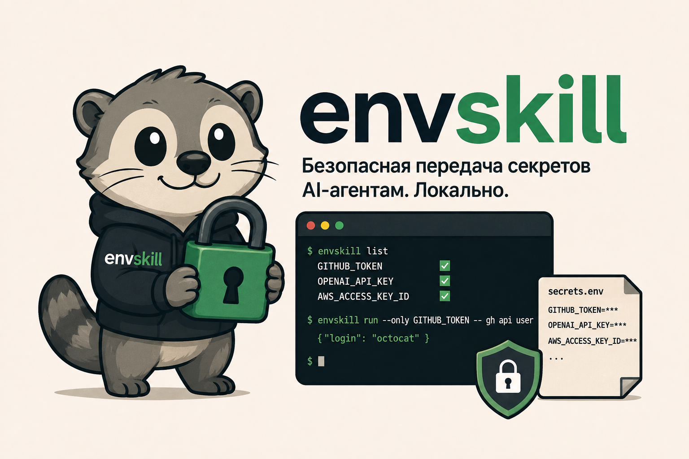

# envskill

[English version](README.md)

<p align="center">
  
</p>

**Передавайте кодовому агенту только те переменные окружения, которые нужны его следующей команде, — без секретов в промптах, скиллах, репозитории и истории команд.**

`envskill` — локальная CLI-утилита и переносимый [Agent Skill](https://agentskills.io/). Она хранит секреты в приватном локальном хранилище, позволяет агенту узнавать имена переменных (но не значения) и передаёт в дочерний процесс только явно указанный набор.

Работает с Codex, Claude Code, Hermes Agent и другими хостами, совместимыми с Agent Skills.

## Начните отсюда

Нужен Python 3.9+ на macOS или Linux.

Установите через Homebrew:

```bash
brew install buhaistrikalo/envskill/envskill
```

Создайте приватное хранилище и настройте скилл для найденных кодовых агентов:

```bash
envskill setup
```

Добавьте секрет через скрытый ввод и запустите с ним ровно одну команду:

```bash
envskill set GITHUB_TOKEN
envskill run --only GITHUB_TOKEN -- gh api user
```

`envskill` никогда не печатает сохранённые значения. `setup` завершает работу проверкой без вывода значений; позже её можно повторить через `envskill doctor`.

## Зачем это нужно

Передавать агенту весь `.env` обычно избыточно: все несвязанные креды попадают в каждую команду, а риск случайной утечки растёт.

envskill задаёт более узкую границу:

```bash
envskill list
envskill has OPENAI_API_KEY
envskill run --only OPENAI_API_KEY -- python app.py
```

Команда получает минимально необходимое окружение и только имена, явно перечисленные в `--only`.

## Что это такое — и чем не является

envskill — инструмент локальной доставки секретов с минимальными привилегиями для команд, которые запускает агент. Он помогает не копировать секреты в промпты, скиллы, репозитории, аргументы команд и широкое окружение дочерних процессов.

Это не менеджер секретов, не песочница ОС и не защита от вредоносного кода, работающего от вашего пользователя. Процесс, получивший секрет, всё ещё может прочитать и вывести его наружу. Для более сильной защиты используйте вместе с envskill песочницу, ограничение сети, короткоживущие креды и скоупы на стороне провайдера.

В отличие от `.env`, envskill передаёт выбранные имена конкретной команде. В отличие от direnv, он не добавляет секреты автоматически в каждую оболочку каталога. Он дополняет 1Password, Doppler и Infisical: те могут управлять и распространять креды, а envskill узко доставляет локально доступные креды в команду агента.

## Повседневное использование

### Добавить, обновить или удалить переменную

```bash
envskill set GITHUB_TOKEN
envskill unset GITHUB_TOKEN
```

`set` запрашивает значение без отображения на экране. Для автоматизации передавайте значение через стандартный ввод, а не в аргументе командной строки:

```bash
security find-generic-password -w -s my-token | envskill set GITHUB_TOKEN --stdin
```

### Узнать, что доступно

```bash
envskill list
envskill list --json
envskill has GITHUB_TOKEN
```

Эти команды показывают только имена и наличие переменной.

### Запустить с минимальными привилегиями

```bash
envskill run --only GITHUB_TOKEN -- gh api user
envskill run --only AWS_ACCESS_KEY_ID,AWS_SECRET_ACCESS_KEY -- aws sts get-caller-identity
```

Если команде нужна несекретная возможность из родительского окружения, передайте её явно:

```bash
envskill run --only DEPLOY_TOKEN --inherit SSH_AUTH_SOCK -- git push
```

`--all` доступен для намеренно широкого доступа, но агент не должен использовать его без явного разрешения.

### Осознанно перенести dotenv-файл

```bash
envskill import-env --from ~/.env
```

Импортёр читает только указанный путь, сохраняет существующие переменные без `--overwrite`, сообщает количество вместо значений и отклоняет физические многострочные значения в кавычках.

## Agent Skill

`envskill setup` устанавливает встроенный скилл только для обнаруженных поддерживаемых хостов. Для ручной установки:

```bash
envskill install-skill
envskill install-skill --target codex
envskill install-skill --target claude
envskill install-skill --target hermes
```

Переносимый исходник находится в [`.agents/skills/envskill/SKILL.md`](.agents/skills/envskill/SKILL.md). В проектном скилле указывайте только имена, никогда не значения:

```markdown
Для этого сценария нужен `SERVICE_API_KEY`.
Запускайте аутентифицированные команды так:

    envskill run --only SERVICE_API_KEY -- command
```

## Диагностика и хранилище

По умолчанию хранилище находится в `~/.config/envskill/secrets.env`; его можно переопределить глобально через `ENVSKILL_FILE` или для одной команды через `--file`.

```bash
envskill doctor
envskill doctor --agent all --json
```

Doctor работает только на чтение и не выводит значения. Стабильный JSON-формат использует `schema_version: 1`; он сообщает состояние CLI, платформы, хранилища, агентских скиллов и рекомендации без раскрытия секретов или изменения файлов.

Хранилище доступно только владельцу (`0600` на POSIX), обновляется атомарно под блокировкой и отклоняет симлинки, обычные не-файлы, чужое владение и доступ группе/остальным. Оно читается при каждом `envskill run`, поэтому обновлённое значение доступно следующей команде без перезапуска агента.

## Другие способы установки

Формула Homebrew использует ассет тегированного GitHub Release и его SHA-256. Пока PyPI-публикация не готова, текущий тег можно поставить напрямую:

```bash
uv tool install git+https://github.com/buhaistrikalo/envskill.git@v0.3.0
# или
pipx install git+https://github.com/buhaistrikalo/envskill.git@v0.3.0
```

Для установки незарелизенного `main`:

```bash
uv tool install git+https://github.com/buhaistrikalo/envskill.git
```

## Разработка

```bash
uv sync
uv run python -m unittest discover -s tests -v
uv run --with ruff ruff check .
uv build
```

## Безопасность

О сообщении об уязвимостях и границах модели безопасности — в [SECURITY.md](SECURITY.md).

## Лицензия

MIT
